#### 分布式系统

---

##### 0 - Intro

* 应用在网络中需要考虑: traffic data rate, traffic pattern (bursty, constant bit rate), traffic target (multipoint, single dest, mobile, fixed), delay sensitivity, loss sensitivity

* Basic Network: Node, Link

* Local Area Network (LANs) 局域网

  * 优点: lower cost, short distance (faster links, low latency, efficiency), one management domain 管理区域, more homogenous 同质
  * 例子: Ethernet, Token ring, FDDI, 802.11 wireless
  * multiplexing 需要 switched network

* Circuit Switching

  * 实现思路
    * source建立通往dest的connection，途径的结点会保存这个connection
    * source向dest发数据，直到找到path之前，不需要在数据中包含dest address
    * connection被显示地中断

  * 类比： telephone network
  * 优点：
    * fast and simple data transfer (circuit建立就能传输)
    * predictable performance (guaranteed bandwidth)
  * 缺点：
    * bursty traffic时circuit会长时间中断idle
    * 用户有different bandwidth needs

* Packet Switching
  * circuit并不是被抛弃的技术，只是换了设备，很多依然都是在用circuit switching，在大的网络传输中依然有QoS的保障
  * 实现思路
    * source发送的数据中包含address信息，可能需要将single message break开变成multiple个（需要包头）
    * 每个发往dest的packet都是独立的，switch通过address信息来forward
  * 类比： a letter in surface mail
  * 优点： 
    * efficient, 可以发送任何已经ready的数据
    * general, 可以发送多种type的application数据
    * accommodate bursty traffic, 适应traffic，增加了queue
    * store and forward, packet中带有address，可以reordering
  * 缺点：可能造成congestion和delay

* Network Goals
  * 效率 efficiency，自我演进 evolvability，可管理 managability，安全 security，scalability 可扩展
  * 作业：登录到wifi路由器的参数，看看有什么参数可以设置
    * net，ip地址，掩码，黑名单，白名单
    * 192.168.1.1

* Challenges for Network
  * Geographic scope 地理范围（第一代以太网，能转能发信息，单工）
  * Scale 扩展性（家用网）
  * Application types（从email到视频会议）
  * Trust and Administration
    * Corporate network： network provider
    * ISP开始向云商聚集（腾讯），涉及到NFV/SDN的功能

* Challenges of the Internet
  * 挑战类型：Address formats，performance（带宽，延迟），packet size，loss rate/pattern/handling 丢包模式，routing，diverse network technologies，scale
    * TCP：最小50B最大1500B
  * 更多需求： Performance guarantees(QoS)，Reliability(Corruption, Lost packets) 可靠性, Flow and congestion control 拥塞控制, Fragmentation, In-order delivery
* 一些问答
  * How to find Nodes?  Naming 域名，Routing
  * What if data get corrupted?  Add a checksum
  * What if Network is Overloaded? Buffering and Congestion Control
  * What if data get lost?  Timeout and Retransmit
  * What if data doesn't fit?  Fragment data across packets
  * What if data is out of order? Add Sequence Numbers

---

##### 1 - layering

##### Layers and protocols

* Layering
  * 特点：
    * 每一个layer都依赖底层的service，并给上层提供service
    * 定义接口来和同层的host交互
    * 隐藏底层实现，black box
  * 缺点： 
    * 上层可能需要duplicate lower level实现的功能 error recovery
    * 不同layer可能需要same info， timestamp，MTU
    * 严格分层可能会影响performance
    * 有的layer并不能完全separated
    * interface不一定标准化

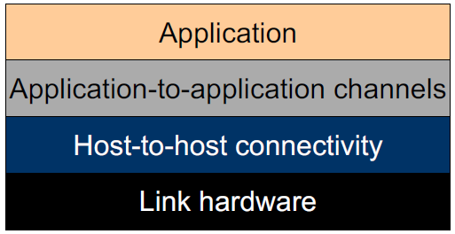

* Protocol: 定义提供给上层的API，定义同层之间的调用接口（syntax，semantics） -> standardization 标准化

* OSI Model（7层）及简化模型
  * Physical (transmit bits)
  * Data Link (transmit frames)
  * Network (route packets)
  * Transport (send packets end2end)
  * Session (tie flow together)
  * Presentation (byte ordering, security)
  * Application (everything else)

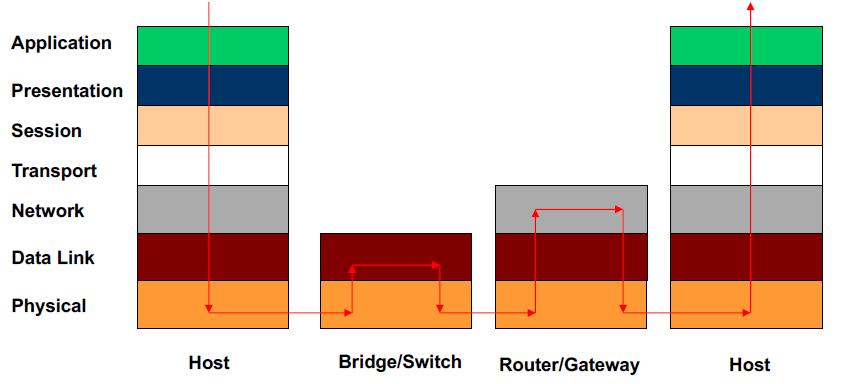

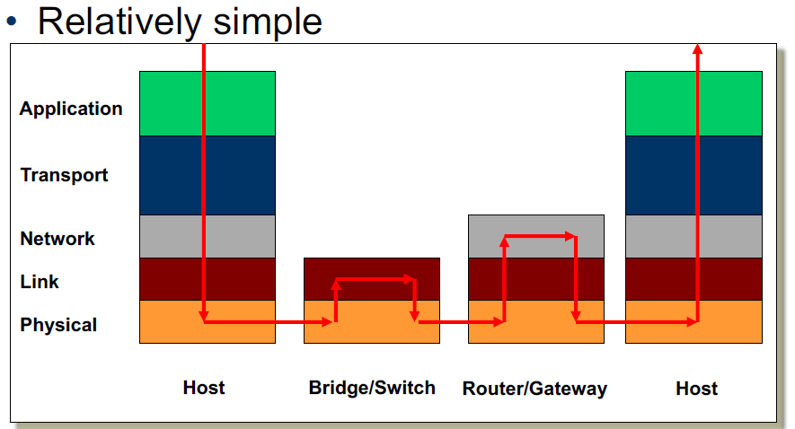

* Internet 沙漏模型
  * Multiplexing and Demultiplexing 各种形式的包头，每个layer都有多种不同的选择

##### Design principles in internetworks

* Network Design Goals 由主及次
  * 0 Connect existing networks
  * 1 Survivability
  * 2 Support multiple types of service
  * 3 Must accommodate a variety of network
  * 4 Allow distributed management
  * 5 Allow host attachment with a low level of effort
  * 6 Be cost effective
  * 7 Allow resource accountability
* Goal 0 : Connect existing networks 连接已有网络
  * 不同类型的网络： ARPANET, X.25 networks, LANs, satellite networks, packet networks, serial links
    * 不同之处： address format, performance (bandwidth/latency), packet size, loss rate/loss pattern/loss handling, routing
  * Problem 1. Address format
    * naive方式：做一堆translation
    * 合理方式：构建一个common format
    * **Principle 1: IP over everything**，是一个兼容层
  * Problem 2. Different Packet Size
    * naive方式：定义maximum packet size，但可能要么不够大要么太大
    * 合理方式：实现fragmentation和re-assembly，拼接
  * IP Standardization
    * Minimum set of assumptions for underlying net 底层网络的最小假设集
    * 优点：连接不同类型的network，对应用隐藏底层实现
      * Perfect reliability
      * Broadcast, multicast
      * Priority handling of traffic
      * Internal knowledge of delays, speeds, failures
    * 同时，Goal 3 Must accommodate a variety of network 也被解决
    * 缺点：No assumption, no guarantee
  * **Principle 2: IP Layering**

* Goal 1： Survivability 稳定性、可靠性
  * **Principle 3: Fate Sharing**
    * endpoint crash丢失TCP state是可以接受的，intermediate router reboot是不能接受的
    * NATs and firewall
    * tradeoff，相信endpoint的可靠性，或者在end host存更少的信息，实现Internet level recovery技术
  * **Principle 4: Soft-state**
    * 包括：Announce state, Refresh state, Timeout state，用这些状态来维持稳定性
    * timeout，缺点是影响performance，但能提供robust 鲁棒性
  * **Principle 5: End-to-End Argument**
    * 网络中两个实现功能的位置： inside the network，at the edge
    * 两种保证Reliable File Transfer的策略
      * Solution 1, 保证所有step都reliable，然后连接起来
      * Solution 2， 端到端做check and retry（完整的功能只有在application layer实现，lower layer的可靠性不一定要保证）
    * 在lower layer保证reliability可行吗？最多只能提升performance，仍然不能保证完全correctness
    * 需要实现的功能： Reliable/sequenced delivery, Addressing/routing, Security, Ethernet collision detection, Multicast, Real-time guarantee

* Goal 2: Support multiple types of service 支持多种类型的服务
  * **Principle 6: network layer provides one simple service: best effort datagram (packet) delivery**，所有packet的处理方法都一样
    * network的核心element会相对简单
    * 可以构建reliable data stream这种service
    * network可扩展性好
  * Type of Service: TCP & UDP
    * TCP: 需要reliable的elastic app，remote login，email
    * UDP： in-elastic，loss-tolerant app，实时语音，视频
    * tradeoff： latency & reliable delivery（现在网络的延迟大约在100ms RTT）
* Goal 4: Allow distributed management, Decentralization 去中心化
  * Principle 7: Each Network owned and managed separately，各自独立管理
  * Principle 7' : Be conservative in what you send and liberal in what you accept，发包保守，收包自由
    * 因为很多协议都模棱两可，所以要限制write

* Goal 5: Allow host attachment with a low level of effort
  * host上要有配套的hard part，支持transport service

* Goal 6: Be cost effective
  * 随着发展，packet overhead在下降，packet loss rate在下降，在经济上scale out更优，internet比dedicated network便宜

* Goal 7: Allow resource accountability 问责制
  * Accounting的策略：billing 收费，Inter-ISP payment
  * Accountability and security
    * Worm, Viruses, 病毒
    * Authentication, 认证，隐私
* IP Design的缺点
  * Weak administration and management tools，管理缺失
  * Incremental deployment difficult at times，部署困难

---

##### 1 - Physical Layer

* 数据传输的理论依据
  * 傅里叶分析，Bandwidth-Limited Signal, Maximum data rate of a channel

* 数据传输的方式
  * Magnetic Media, 磁性媒体
  * Twisted Pair, 双绞线
  * Coaxial Cable, 同轴电缆
  * Fiber Optics, 光纤, Fiber Cable 光纤电缆

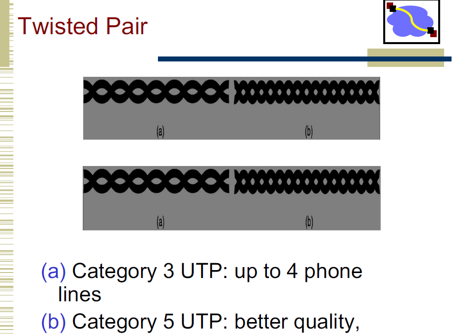

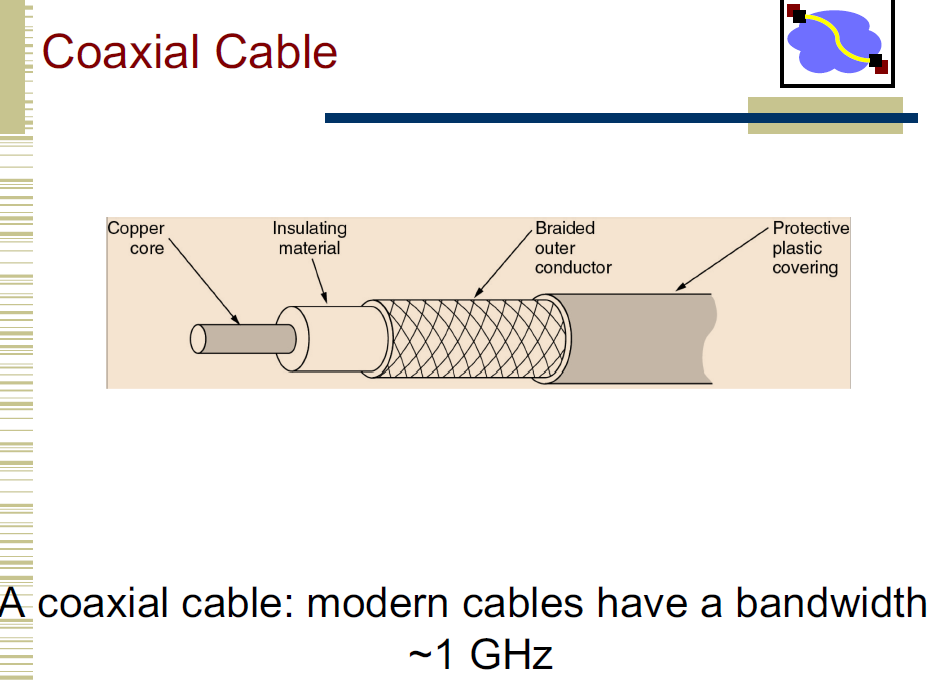

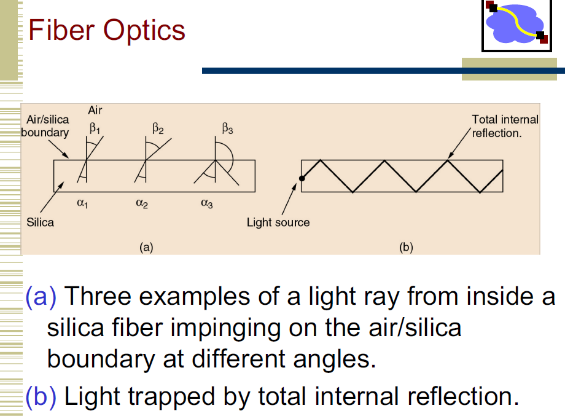

* Wireless Transmission 无线传输
  * The Electromagnetic Spectrum，电磁频谱
  * Radio Transmission，无线电传输
  * Microwave Transmission，微波传输
  * Infrared and Millimeter Waves，红外线及毫米波
  * Lightwave Transmission，光波传输

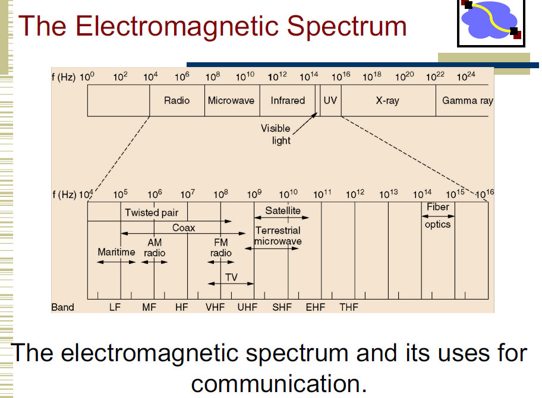

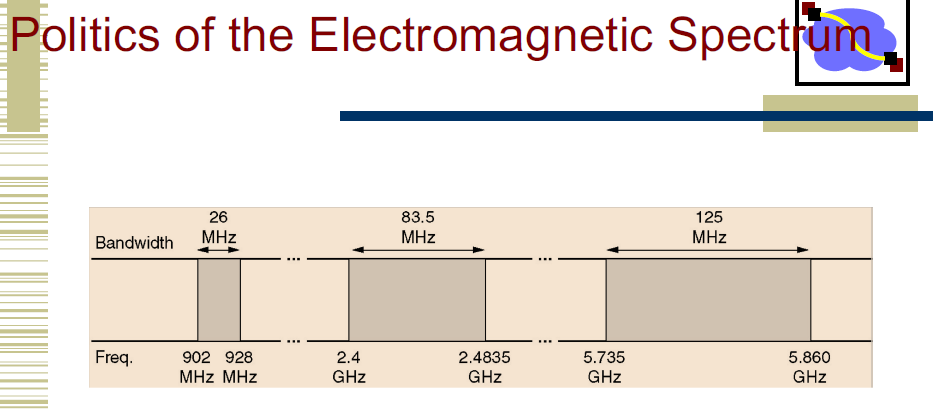

* Communication Satellites 通信卫星
  * Geostationary Satellites，地球同步卫星
  * Medium-Earth Orbit Satellites，地球轨道卫星
  * Low-Earth Orbit Satellites，近地轨道卫星
  * Satellites versus Fiber，卫星光纤
  * Globalstar，全球星

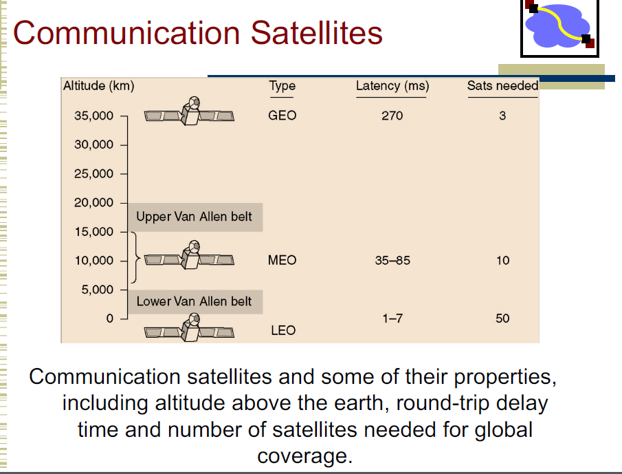

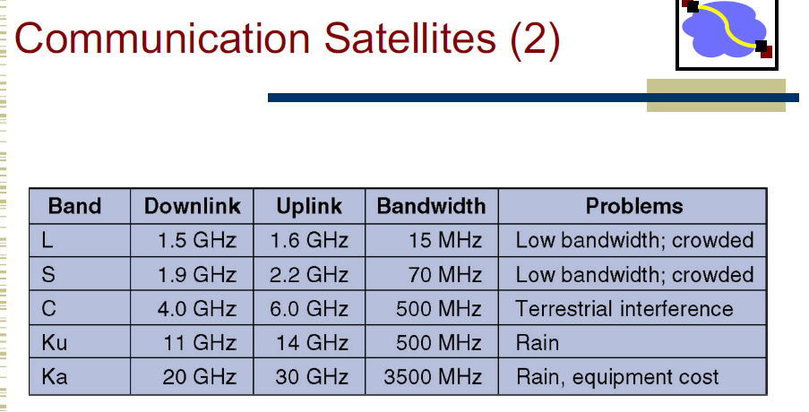

---

##### 2 - Data Link Layer

* Data Link Layer Design
  * Services Provided to the Network Layer
  * Framing
  * Error Control
  * Flow Control
* Data Link Layer的功能
  * Provide service interface to the network layer 为网络层提供服务接口
  * Dealing with transmission errors 处理传输错误
  * Regulating data flow 调节数据流
  * Slow receivers not swamped by fast senders 使得快的发送者不会淹没慢的接收者
  * Feedback-based flow control 基于反馈的流量控制
  * Rate-based flow control 基于速率的流量控制

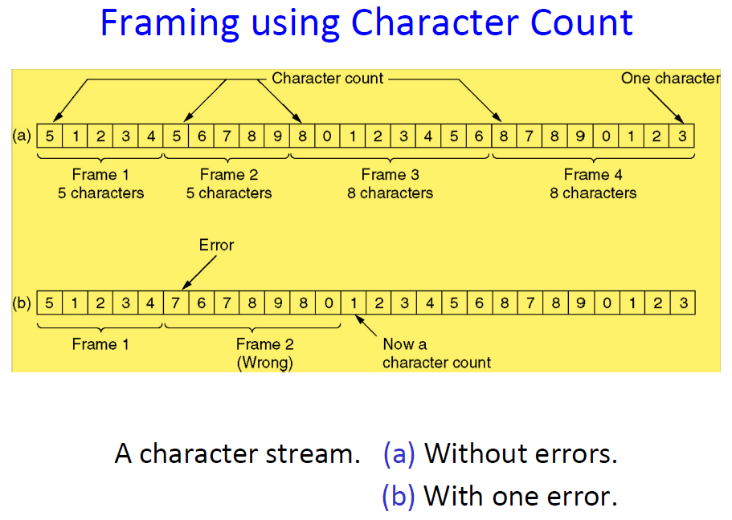

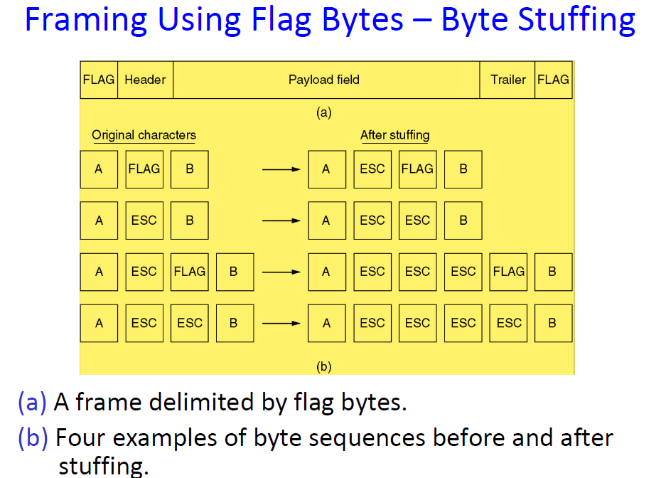

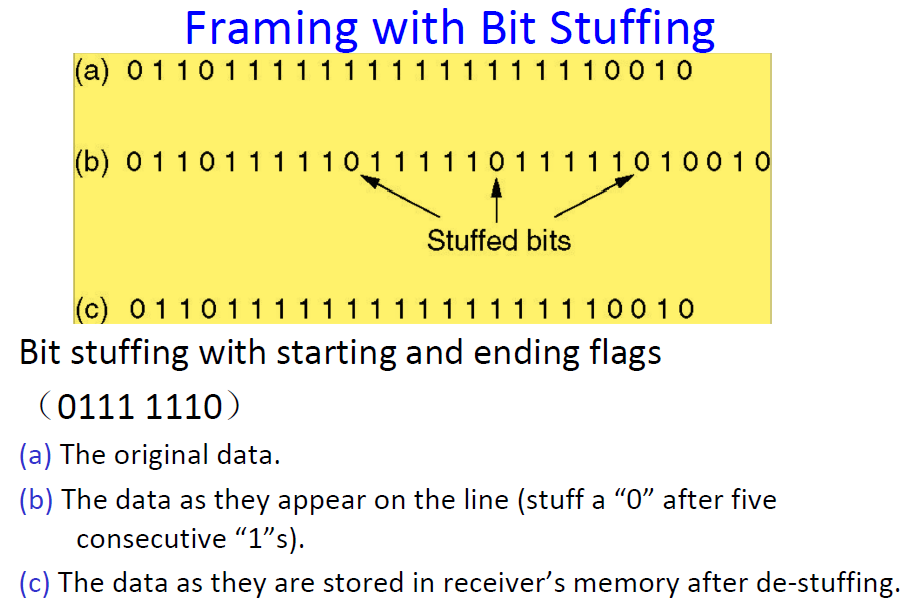

* Error-Correcting Codes, 让receiver知道实际传输的消息是什么
  * 优点：quick recovery
  * 缺点：overhead on all message
  * 当重传代价较大，或者传输错误率很高时，用error-correction
* Error-Detecting Codes, 让receiver知道传输是否有错误发生
  * 优点：overhead only on message with error
  * 缺点：cost in bandwidth and latency for retransmission

* Hamming Code

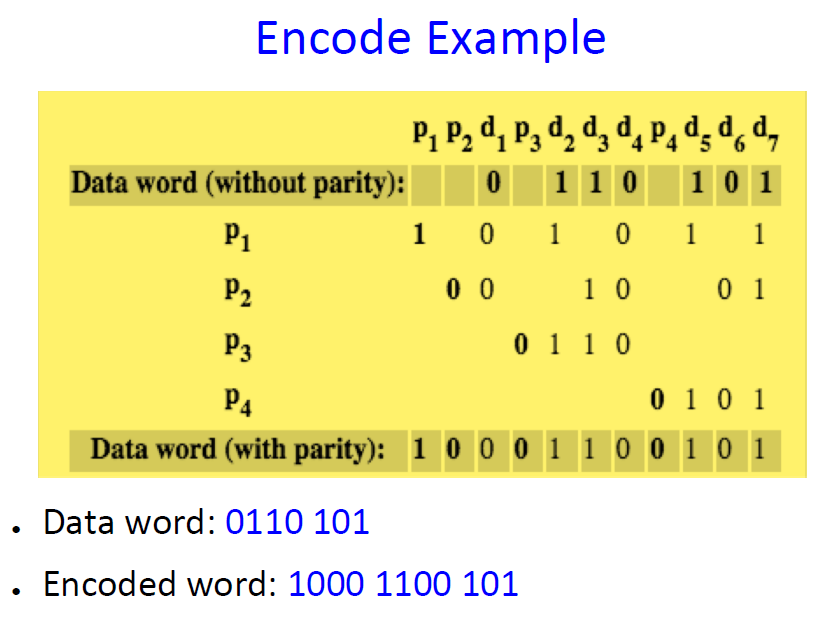

* Cyclic Redundancy Check (CRC)

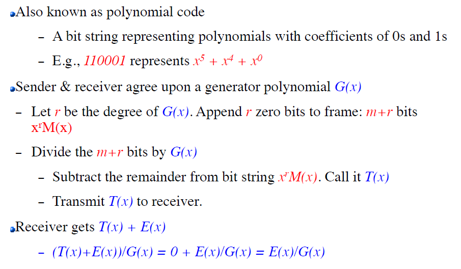

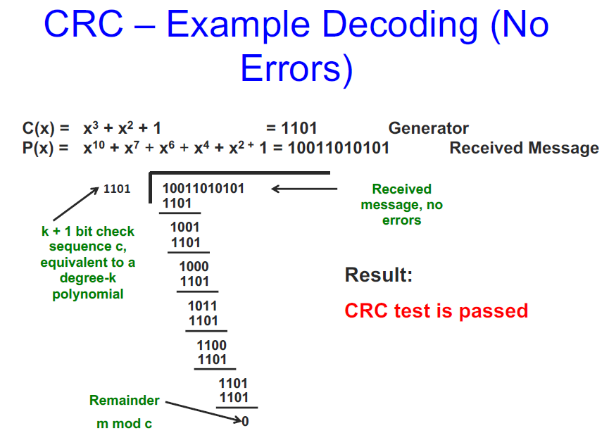

---

##### 2 - Sliding Window Protocols

* Elementary Data Link Protocols 基本数据链路协议
  * An Unrestricted Simplex Protocol
  * A Simplex Stop-and-Wait Protocol
  * A Simplex Protocol for a Noisy Channel

* Sliding Window Protocols
  * 设计基础：duplex communication 双工通信，data packet中可以包含ack
  * 协议：
    * A One-Bit Sliding Window Protocol
    * A Protocol Using GO Back N
    * A Protocol Using Selective Repeat

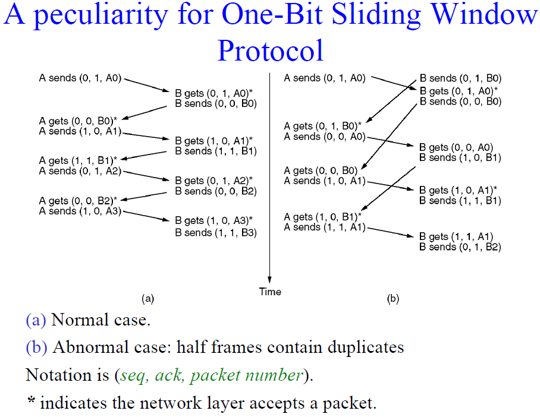

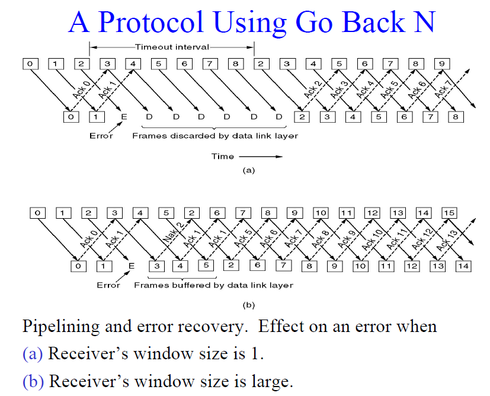

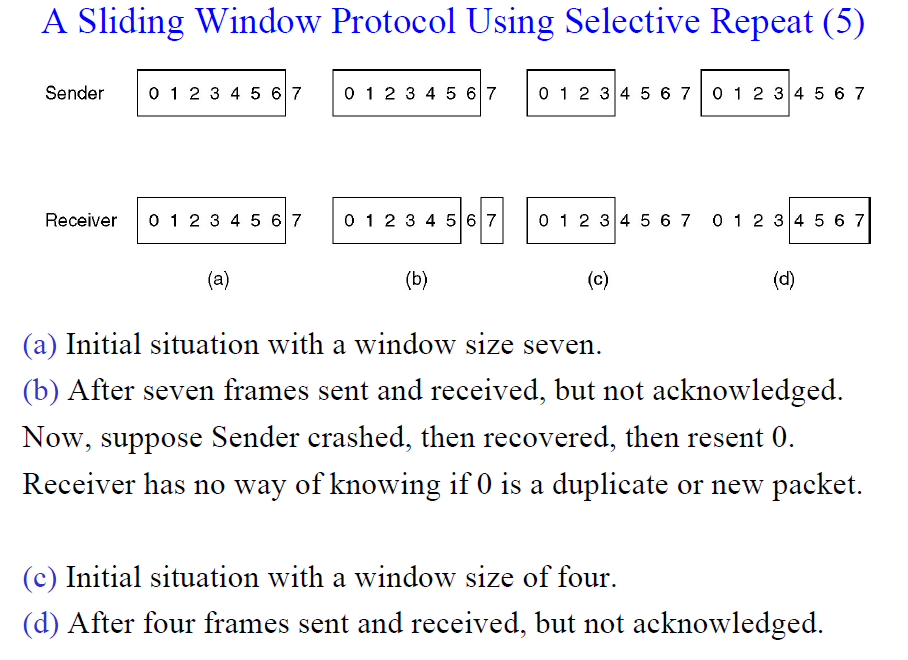

